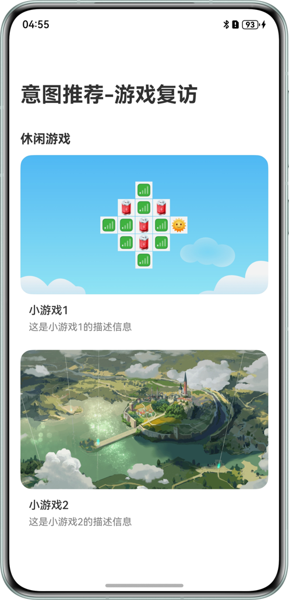
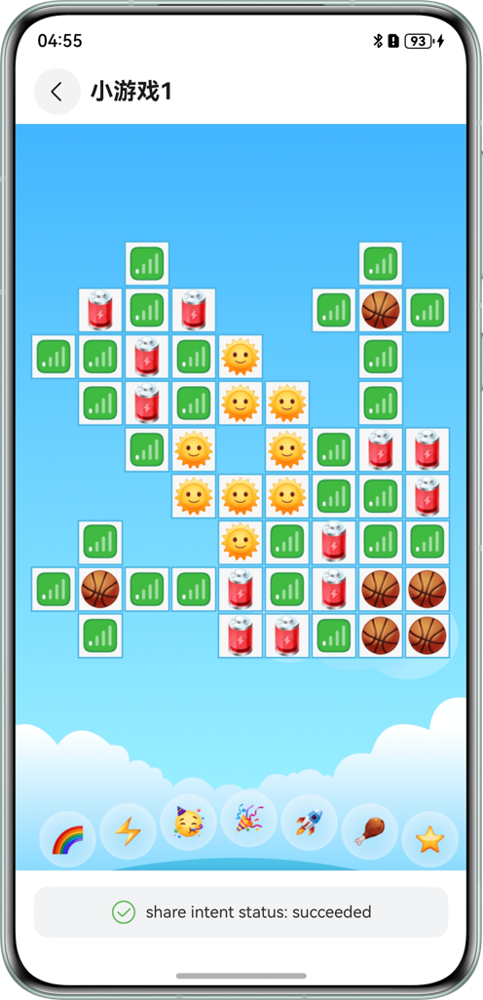

# 基于意图框架习惯推荐常用复访示例代码

## 介绍

- 本示例基于意图框架，使用`@kit.IntentsKit`实现意图共享，使用`@kit.AbilityKit`的`InsightIntentExecutor`
  实现意图调用。根据意图调用的参数实现游戏复访。

## 效果预览

| 主页                               | 游戏页                                      | 小艺卡片展示共享意图                               | 点击意图卡片实现复访                                 |
|----------------------------------|------------------------------------------|------------------------------------------|--------------------------------------------|
|  |  | |  |

使用说明：
1. 点击`小游戏1或2`的卡片进入游戏卡片页面。进入游戏页面会调用 shareIntent()接口。游戏卡片页面底部会显示接口执行状态。
2. 待系统将共享的意图完成处理后，将会在小艺建议的卡片内展示共享的意图。
3. 点击展示的对应小艺卡片，会重新拉起示例应用，完成游戏卡片的复访。

## 工程目录

```
entry/src/main/
├──ets
|  ├──common/constants
|  |  └──CommonConstants.ets                               // 公共常量类
|  └──common/utils
|  |  ├──FileReader.ets                                    // 文件读取类
|  |  └──Logger.ets                                        // 日志类
|  ├──entryability
|  |  └──EntryAbility.ets                                  // 入口Ability
|  ├──insightintents
|  |  └──IntentExecutorImpl.ets                            // 意图调用类
|  └──pages
|     ├──Index.ets                                         // 首页
|     └──PlayPage.ets                                      // 详情页
└──resources
   ├──base
   |  ├──profile
   |  |  ├──insight_intent.json                            // 意图注册配置
   |  |  └──main_pages.json                                // 应用界面列表
   └──rawfile
      ├──shareIntent.json                                  // 意图共享数据示例
      └──game.json                                         // 游戏信息示例
```

## 具体实现

意图共享源码参考PlayPage.ets中的shareIntent方法，意图调用源码参考IntentExecutorImpl.ets中的onExecuteInUiAbilityForegroundMode方法

* 首页：从game.json文件中读取游戏信息，ForEach生成游戏卡片，卡片的onClick事件中通过navPathStack.replacePathByName跳转到游戏页面
* 游戏页：游戏页根据导航参数，显示游戏相关信息
* 意图共享：游戏页在aboutToAppear事件中调用shareIntent方法，根据游戏id，在事先读取的shareIntent.json数据中筛选出相关意图数据，然后调用insightIntent.shareIntent
  API实现意图数据共享
* 意图调用：在onExecuteInUIAbilityForegroundMode方法中，使用eventHub.emit广播事件，传递entityId游戏id参数。
  index.ets中通过eventHub.on监听事件，通过navPathStack.replacePathByName触发跳转到游戏页面
* 意图调用热启动时通过eventHub传递参数给首页，冷启动时通过onCreate方法借助localStorage对象将want特定参数传递给首页
* 本示例意图调用没有过多介入业务逻辑和UI逻辑，只是通过不同渠道把相关参数传递给业务，将页面跳转主动权交给业务本身。
  onExecuteInUIAbilityForegroundMode接口也提供了WindowStage实例，可以使用windowStage.loadContent加载特定页面，应用根据实际选择合适的方式。

## 相关权限

### 依赖

1. 本示例依赖@ohos/hvigor-ohos-plugin。
2. 使用DevEco Studio版本大于本示例推荐版本，请根据 DevEco Studio 提示更新 hvigor 插件版本。
3. 需联网登录华为账号并同意小艺建议的用户协议和隐私政策。

### 约束与限制

1. <font>**意图共享和意图调用的测试，当前无法由开发者独立完成，请根据[Intents
   Kit接入流程](https://developer.huawei.com/consumer/cn/doc/harmonyos-guides/intents-habit-rec-dp-self-validation)，通过邮箱向华为意图框架接口人提交验收申请，由接口人配合开发者一同完成测试验收。**</font>
2. 本示例仅支持标准系统上运行，支持设备：华为手机、华为平板。
3. HarmonyOS系统：HarmonyOS 5.0.5 Release及以上。
4. DevEco Studio版本：DevEco Studio 5.0.5 Release及以上。
5. HarmonyOS SDK版本：HarmonyOS 5.0.5 Release SDK及以上。
